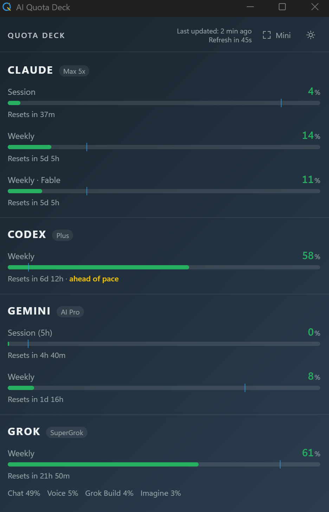
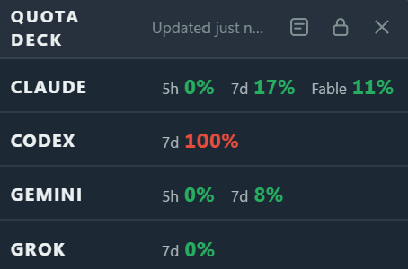
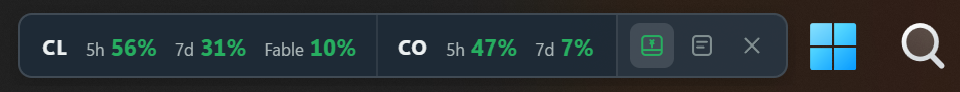

# 📊 AI Quota Deck

A Windows tray dashboard for Claude Code, Codex, Gemini, and Grok usage limits.

📘 [繁體中文](./README.zh-TW.md)

---

## Screenshots

### Dashboard
<p align="center">
  
</p>

### Widget
<p align="center">
  
</p>

### Strip
<p align="center">
  
</p>

The dashboard includes reset times, pace indicators, plan badges, and cached-data status. Widget and Strip views keep the essential color-coded percentages in sight.

---

## What it shows

| Provider | Usage windows | Setup |
|---|---|---|
| **Claude** | 5-hour, weekly, and model-specific limits when available | Sign in to Claude Code |
| **Codex** | Monthly (Free) or weekly (Plus), depending on the account | Sign in to Codex Desktop |
| **Gemini** | 5-hour and weekly | [Advanced Browser Bridge setup](#advanced-gemini-and-grok) |
| **Grok** | Weekly and product breakdown; free query limits when applicable | Browser Bridge, or Grok Build fallback |

Providers that are not configured stay hidden. Each provider refreshes independently, so one failure does not block the others.

Other features:

- Dashboard, Widget, and Strip views
- Always-on-top widget with a remembered, lockable position
- Compact horizontal strip that can float anywhere or pin above the Windows taskbar without reserving work area
- Light, dark, and system themes
- Windows tray controls and optional launch at startup
- Cached readings when a provider or browser is temporarily unavailable
- Claude Code polling pauses while Windows is idle or locked, recovers expired OAuth sessions through the official CLI, and backs off safely after rate limits
In Strip view, click the pin-shaped taskbar button, then drag the Strip to any free part of the taskbar. It yields while the taskbar is auto-hidden or another app is full-screen.


---

## Installation

**Requires Windows 10 or 11.**

1. [Download the latest installer](https://github.com/JoshuaWang2211/ai-quota-deck/releases/latest/download/ai-quota-deck_0.2.3_x64-setup.exe).
2. Run it, then launch **AI Quota Deck**.
3. Close the window to return it to the system tray; left-click the tray icon to reopen it.

**Codex:** sign in to Codex Desktop.

**Claude:** if Claude Code is not detected, install it, run `claude` once in a terminal, and complete sign-in. The CLI does not need to remain open.

---

## Widget and Strip

Use the two buttons at the top of the dashboard:

- **Widget** opens a small always-on-top view. Drag its header to place it; the lock button locks or unlocks that position.
- **Strip** arranges the same values in a compact horizontal bar. Drag anywhere outside its buttons to place it freely; it does not reserve or reduce the Windows work area.

Widget and Strip remember separate positions. Open the dashboard or hide either view with its controls or the tray menu. Both reuse the dashboard's readings and make no additional provider requests.

---

## Advanced: Gemini and Grok

> This setup is more involved. It requires Chromium Developer mode, a manually loaded unpacked extension, and a signed-in Gemini or Grok tab.

Gemini and Grok usage is read from a browser tab through the bundled **AI Quota Deck Browser Bridge**. Skip this section if you only use Claude Code and Codex.

- Gemini requires the bridge.
- Grok prefers the bridge but can fall back to a signed-in Grok Build CLI.
- Verified browsers: Chrome, Comet, Edge, and Brave. Vivaldi, Opera, and Chromium are registered but not yet verified.

### Setup

1. Launch AI Quota Deck once and click **Set up providers**.
2. Copy or open the bridge folder shown by the app:

   ```text
   %LOCALAPPDATA%\ai-quota-deck\browser-bridge
   ```

3. Open `chrome://extensions`, enable **Developer mode**, and choose **Load unpacked**.
4. Select the bridge folder.
5. Click the bridge toolbar icon once to grant desktop communication permission.
6. Keep a signed-in [Gemini](https://gemini.google.com) or [Grok](https://grok.com) tab open.

The card normally appears within about three minutes or when the deck is brought to the front.

### Keep it installed

The bridge and a matching signed-in tab must remain available for fresh readings. Background tabs are fine, but the bridge cannot update while the browser or tab is closed, the account is signed out, or the computer is asleep. The deck keeps the last reading as `cached` and requests a new one after wake or unlock.

After updating AI Quota Deck, restart the browser so it reloads the bundled bridge files.

---

## Standalone Browser Extensions

If you only need to check Gemini or Grok usage without running the desktop app, you can use these standalone Chrome extensions:

- **[Gemini Usage Monitor](https://chromewebstore.google.com/detail/cdepnbhodggenlkdeelnocfckdendhad?utm_source=item-share-cb)**
- **[Grok Usage Watch](https://chromewebstore.google.com/detail/bmpboaihdkpkjehbceegdmndkonlpdge?utm_source=item-share-cb)**

---

## Troubleshooting

**Gemini or Grok is missing:** confirm the bridge is enabled, click its toolbar icon once, and open a signed-in provider tab.

**Browser data is stale:** open the matching tab and allow up to three minutes. The browser, bridge, tab, and tray app must all be running.

**Claude is rate limited:** the cached card shows the countdown. The deck honors the full server cooldown across restarts; new Claude Code credentials clear a deadline tied to the old sign-in.

**Claude did not update while idle or locked:** this is intentional. After you return, the app waits about two minutes before checking so it does not race Claude Desktop or Claude Code during wake-up. An existing rate-limit cooldown still takes priority.

**Claude reports a rejected token:** the deck asks the installed Claude Code CLI to refresh it in the background, then retries automatically. If that fails, open Claude Code once.

**Windows reports an unknown publisher:** current releases are not code-signed. Download them only from this project's GitHub Releases page.

---

## Privacy

AI Quota Deck has no telemetry and uploads nothing.

- It uses sign-ins already stored by the supported desktop or CLI clients.
- It never reads or uses provider refresh tokens. After a Claude `401`, it runs the official `claude update` command in the background and rereads Claude Code's access token; this command may also update Claude Code itself.
- The bridge can read only `gemini.google.com` and `grok.com`.
- Only quota values, reset times, provider/account slots, and observation times reach the app. Cookies and page tokens stay in the browser.

---

## Limitations

These providers expose usage through undocumented internal endpoints. A provider card may stop working when its response format changes; the other providers continue independently.

If the same browser provider is signed in with multiple accounts, the most recently reported account is shown. Account pinning is not implemented yet.

---

## Project

- [Changelog](./docs/CHANGELOG.md)
- [Architecture notes](./docs/ARCHITECTURE.md)
- [Report an issue](https://github.com/JoshuaWang2211/ai-quota-deck/issues)
- Created by [Joshua Wang](https://www.threads.com/@joshuawang2211)

## License

Licensed under the [MIT License](./LICENSE).
